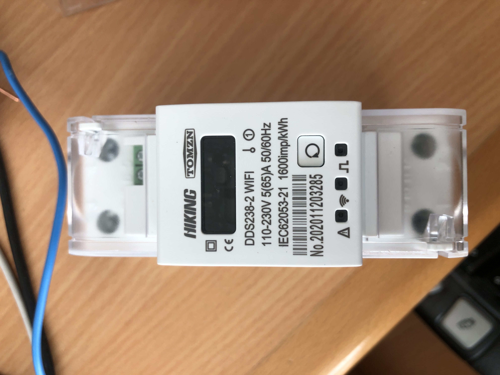
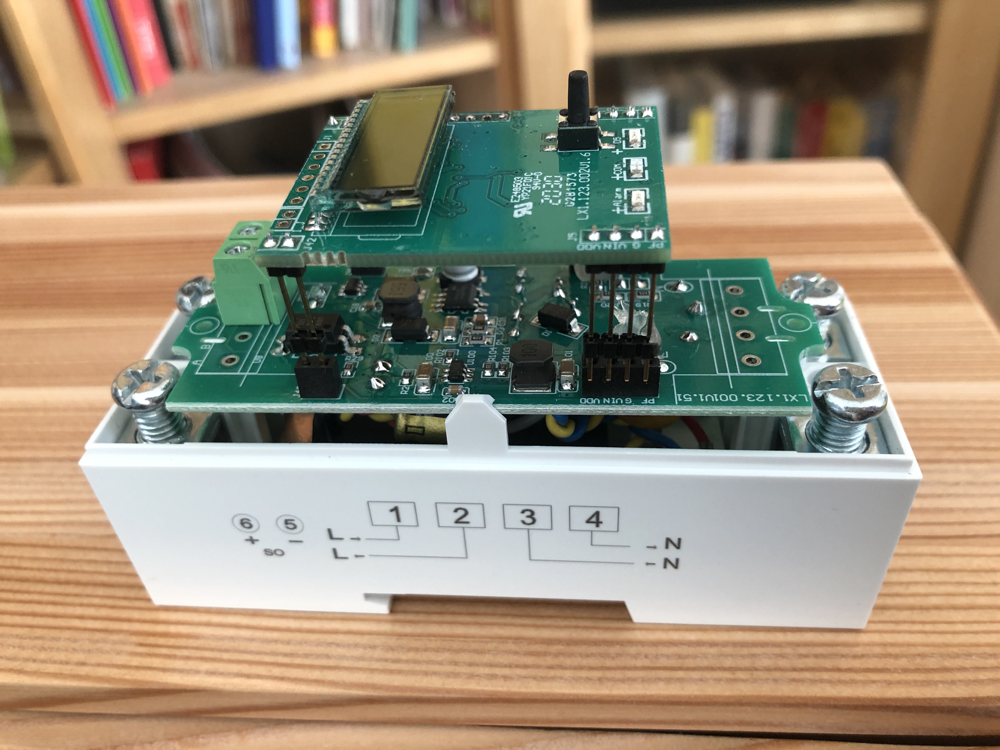
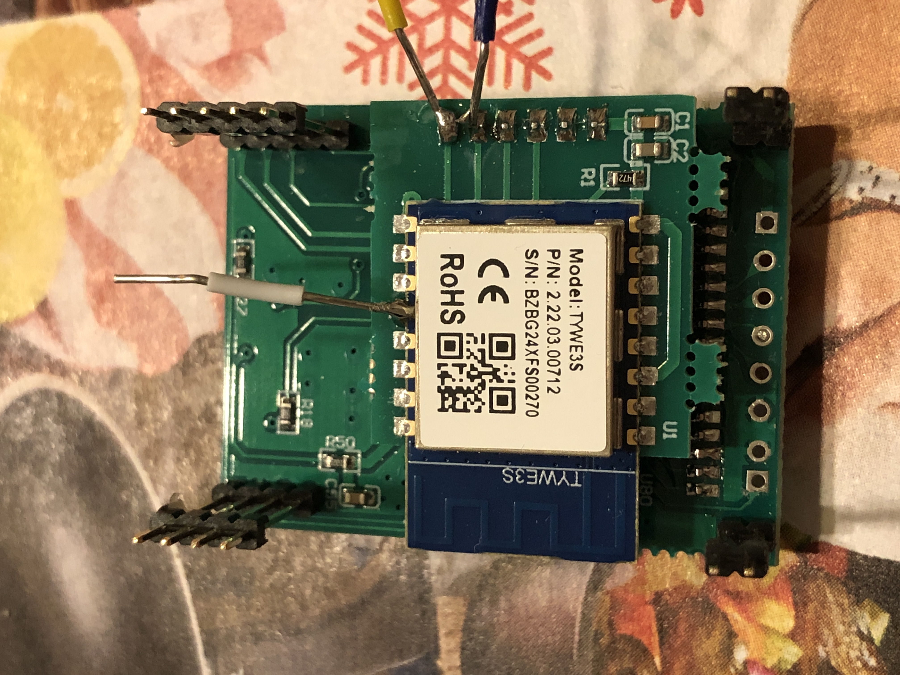
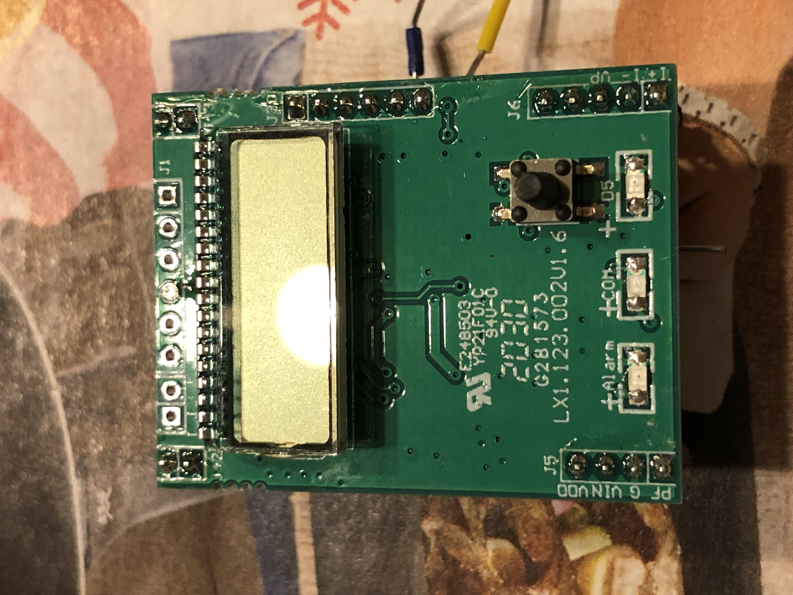
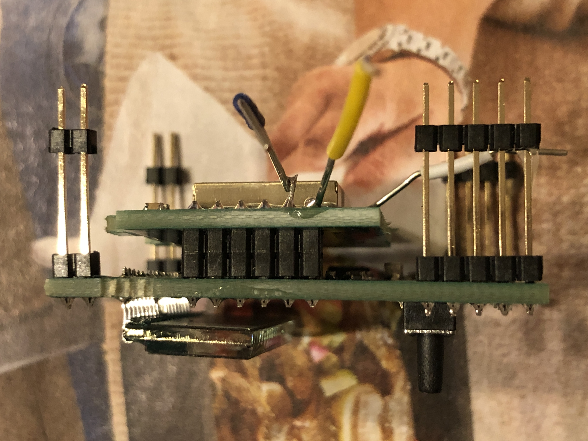
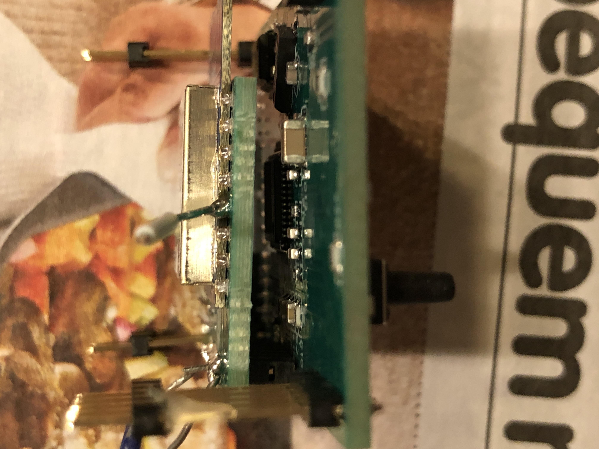
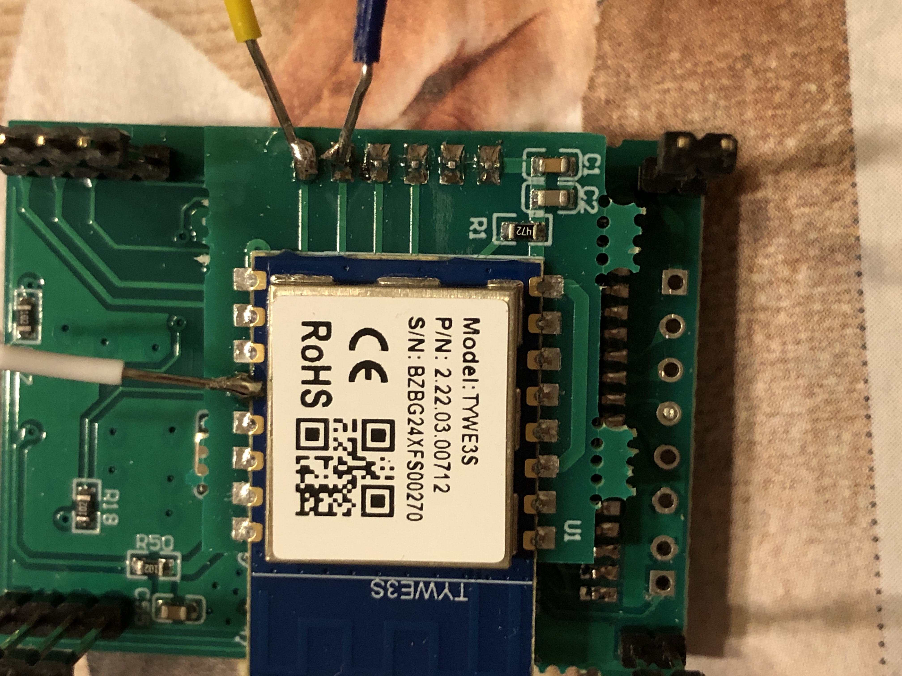
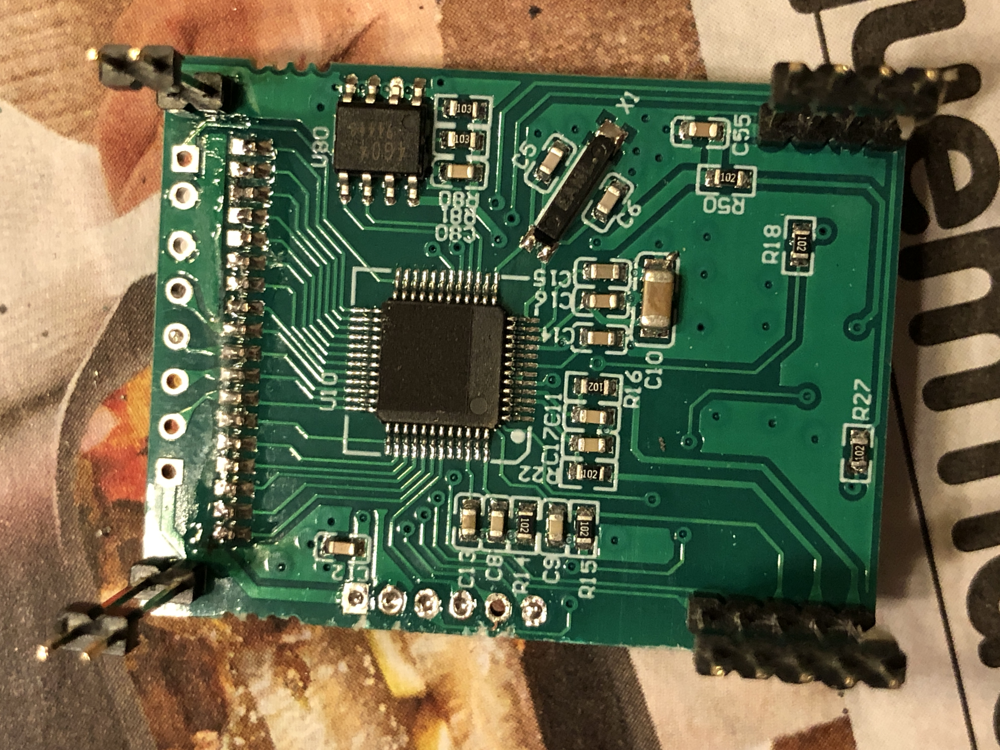
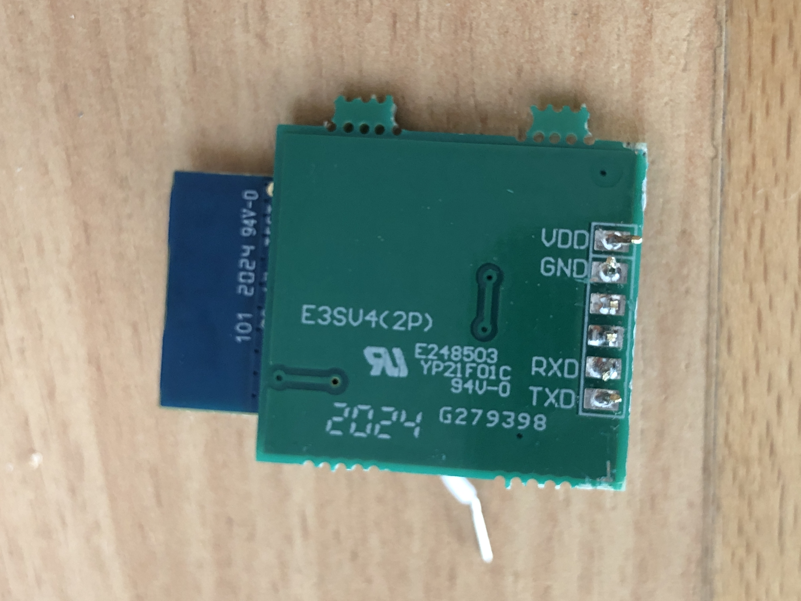
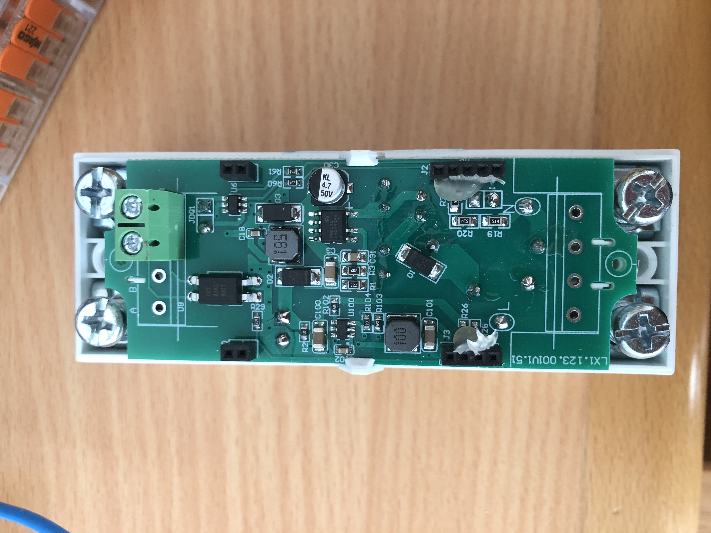

# Hiking-DDS238-2-WIFI-Din-Rail-Energy-Meter-flashing-Tasmota

How to flash the [Hiking DDS238-2 WIFI Din Rail Energy Meter](https://www.aliexpress.com/item/4000571797301.html) with Tasmota...

 

First try was with [tuya-convert](https://github.com/ct-Open-Source/tuya-convert) but this did not work (seems to be newer Firmware) i had to open the device, with the 2 screws on the backside:

 

More pictures from the inside:

 

 

 

 

 

 

 

 

 

to be able to flash the TYWE3S (an ESP8266EX) i had to disconnect it from the metering chip because otherwise it would not respond on the TX/RX Interface...

