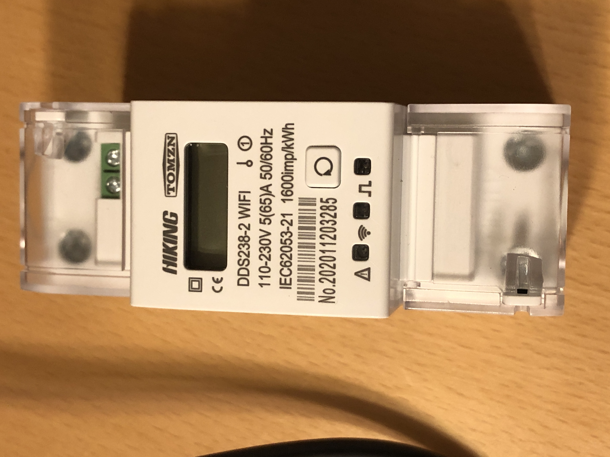
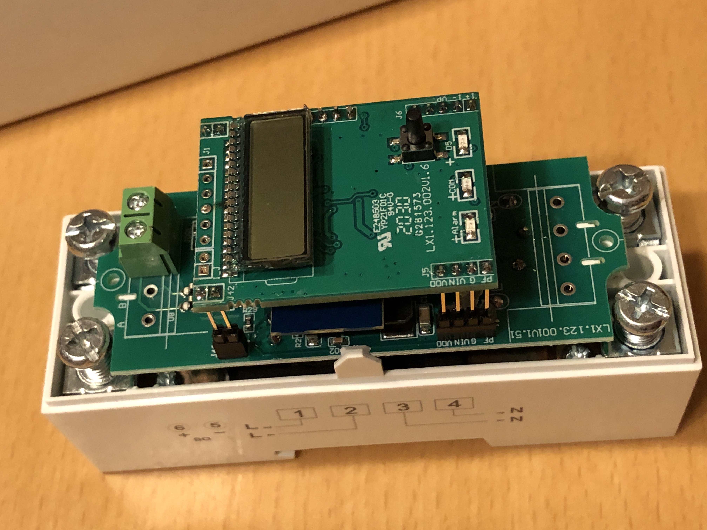
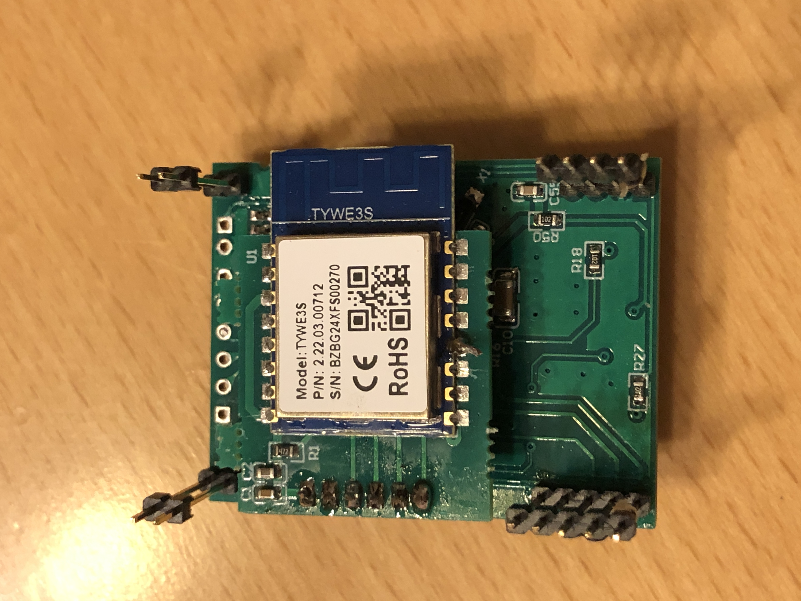
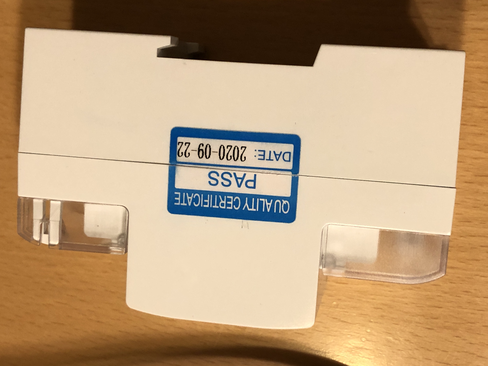
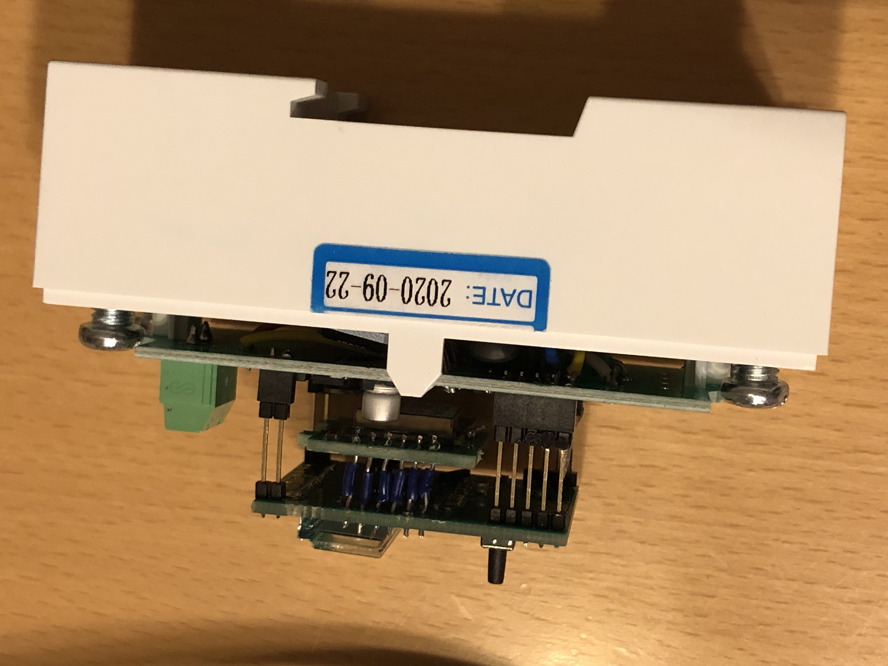

# Hiking-DDS238-2-WIFI-Din-Rail-Energy-Meter-flashing-Tasmota

How to flash the [Hiking DDS238-2 WIFI Din Rail Energy Meter](https://www.aliexpress.com/item/4000571797301.html) with Tasmota...
<p align="center"> </p>

First try was with [tuya-convert](https://github.com/ct-Open-Source/tuya-convert) but this did not work (seems to be newer Firmware) i had to open the device, with the 2 screws on the backside, after that you can remove the cover and access the lcd-board and on the backside of the LCD-board you will find the TYWE3S Board (aka ESP8266EX)
<p align="center">   </p>

Picture of the TYWE3S Board on the left side, Board with the MCU on the right side:
<p align="center">  </p>
because the RX/TX of the ESP8266 is connected to the MCU under it, i had to desolder the ESP-Board to be able to flash it, the needed pin layout can be found here: https://tasmota.github.io/docs/devices/TYWE3S/

after desoldering the ESP-Board, the flashing was easy, soldering together was not so easy, because the ESP-Board does have smaller holes (standard 2.54 are to big)
my board after putting it together:
<p align="center"> </p>

After flashing via USB-to-Serial adapter, only the software part is left to do. After basic Wifi Setup of Tasmota apply this Template:

Tasmota Version > 9.1 Template
```console
{"NAME":"Hiking DDS238-2 WIFI","GPIO":[0,2272,0,2304,0,0,0,0,0,0,320,0,32,0],"FLAG":0,"BASE":54}
```
Tasmota Config for TuyaMCU to paste into Console:
```console
Backlog TuyaMCU 33,20; TuyaMCU 32,18; TuyaMCU 31,19;
```
Tasmota Config : Publishing TuyaReceived to MQTT; Show Voltage with 1 Decimal
```console
Backlog SetOption66 1; VoltRes 1;
```
Rule to update Data on boot and every 5 seconds afterwards...
```console
Rule1 on System#Boot do RuleTimer1 5 endon on Rules#Timer=1 do backlog TuyaSend8; RuleTimer1 5 endon
```
Activate Rule1
```console
Rule1 1;
```
More pictures from the inside:
<p align="center">  </p>

<p align="center"> </p>
<p align="center">  </p>
<p align="center"> </p>
<p align="center"> </p>

<p align="center"> </p>
<p align="center">  </p>

