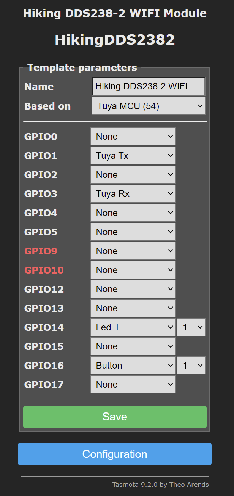

# Hiking-DDS238-2-WIFI-Din-Rail-Energy-Meter-flashing-Tasmota

How to flash the [Hiking DDS238-2 WIFI Din Rail Energy Meter](https://www.aliexpress.com/item/4000571797301.html) with Tasmota...

<b>Update 2023-05-17: User reported that new Hiking-DDS238-2-WIFI comes with the WR3 Chip instead of the TYWE3S, so this will not work with that chip!!</b>

<p align="center"> </p>

First try was with [tuya-convert](https://github.com/ct-Open-Source/tuya-convert) but this did not work (seems to be newer Firmware) i had to open the device, with the 2 screws on the backside, after that you can remove the cover and access the lcd-board and on the backside of the LCD-board you will find the TYWE3S Board (aka ESP8266EX)
<p align="center">   </p>

Picture of the TYWE3S Board on the left side, Board with the MCU on the right side:
<p align="center">  </p>

~~because the RX/TX of the ESP8266 is connected to the MCU under it, i had to desolder the ESP-Board to be able to flash it~~, the needed pin layout can be found here: https://tasmota.github.io/docs/devices/TYWE3S/

according to user @chaveiro it should be possible to flash without soldering, see the pinout here: https://user-images.githubusercontent.com/4527135/124747294-b04dd780-df19-11eb-962f-7e01ce873563.png

### Backup original Firmware:
Save bakup of original firmware:
```console
python esptool.py --port COM15 --baud 115200 read_flash 0x00000 0x100000 backup1.img
```

Restore original firmware:
```console
python esptool.py --port COM15 --baud 234000 write_flash -fm qio -fs 1MB 0x00000 backup1.img
```

### Flashing Tasmota
use https://github.com/tasmota/tasmotizer

~~after desoldering the ESP-Board~~, the flashing was easy, soldering together was not so easy, because the ESP-Board does have smaller holes (standard 2.54 are to big)
my board after putting it together:
<p align="center"> </p>

After flashing via USB-to-Serial adapter, only the software part is left to do. After basic Wifi Setup of Tasmota (i did use 9.1.0.2) apply this Template:

Tasmota Version > 9.1 Template
```console
{"NAME":"Hiking DDS238-2 WIFI","GPIO":[0,2272,0,2304,0,0,0,0,0,0,320,0,32,0],"FLAG":0,"BASE":54}
```
should look like that after applying this template:
<p align="center"> </p>

Tasmota Config for TuyaMCU to paste into Console:
```console
Backlog TuyaMCU 33,20; TuyaMCU 32,18; TuyaMCU 31,19; TuyaMCU 37,101;
```
*dpId=9 seem to be a timer to toggle the device relay, set it to any value and it starts counting down, by the time it reaches 0 the relay toggles state. As far as I know, this can't be used in Tasmota*

Tasmota Config : Set reference for total energy to internal counter; Publishing TuyaReceived to MQTT; Show Voltage/Power with 1 Decimal
```console
Backlog SetOption72 1; SetOption66 1; VoltRes 1; WattRes 1;
```
Rule to update Data on boot and every 5 seconds afterwards...
```console
Rule1 on System#Boot do RuleTimer1 5 endon on Rules#Timer=1 do backlog TuyaSend8; RuleTimer1 5 endon
```
Rule to publish TotalkWh value and correct the value (no longer needed starting with Tasmota Firmware >= 9.5.0)
```console~~
Rule2
  ON TuyaReceived#DpType2Id101 DO Backlog var1 %value%; MULT1 0.01; event sendTotalkWh ENDON
  ON event#sendTotalkWh DO publish tele/SmartEnergyMeter/TotalkWh %var1% ENDON
```

Activate Rule1 and Rule2 (Rule 2 is no longer needed starting with Tasmota Firmware >= 9.5.0)
```console
Backlog Rule1 1; Rule2 1;
```
More pictures from the inside:
<p align="center">  </p>

<p align="center"> </p>
<p align="center">  </p>
<p align="center"> </p>
<p align="center"> </p>

<p align="center"> </p>
<p align="center">  </p>

